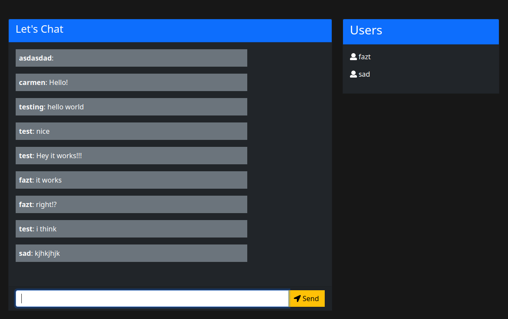

# Javascript Full Stack
is a simple chat that was built with entire javascript technologies, for the frontend, backend and database. 

# Used Technologies
- Nodejs
  - Express
  - Socket.io
- Mongodb

# Links and Resources used in this project
- [Bootstrap4 CDN](http://getbootstrap.com/docs/4.0/getting-started/introduction/)
- [Background Gradient Color](https://uigradients.com/#Lawrencium)
- [jQuery CDN](https://code.jquery.com/)
